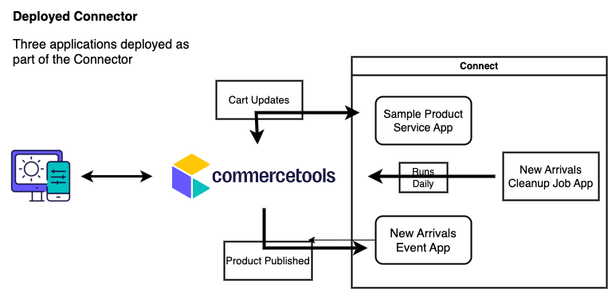

   
  <b>A demo Connector to get started and learn about commercetools Connect</b>

## About & Scope

This Connector is to be used in self-learning training modules only. It contains three applications:
1. a service app that allows distributing a sample product with limited configurable quanyity 
2. an event app that manages products in new arrivals 
3. a cleanup job app that runs daily to remove products from the new arrivals category after 30 days

## Prerequisite

- commercetools Composable Commerce account
- API Credentials to your project

To create an API Client in the Merchant Center, go to Settings > Developer settings > Create new API client.
Take note of the following:
  - CTP_PROJECT_KEY
  - CTP_CLIENT_ID
  - CTP_CLIENT_SECRET

## How to Install

Deploy this demo Connector into any project to learn and experience how commercetools Connect makes integrations quick and easy. Follow the steps from the [commercetools connect deployment documentation](https://docs.commercetools.com/connect/concepts#deployments).

This Connector contains three applications, each of a different type.

### free-sample-product-service

It allows you to distribute a free sample product. You provide the SKU of the sample product that you want to add to all carts with the minimum total value. You can also provide the total quantity to be offered as free sample.

Configurations:

1. Sample product's SKU 
2. Free quantity offered
3. Minimum cart value (in cents)
4. API credentials to your project

### new-product-event-app

This event type app is triggered by the notification that is generated whenever a product is published. It adds the product to the new category if the product is less than a month old.

Configurations:

1. Category key for new arrivals
2. API credentials

### new-category-cleanup-job-app

This job runs every day and removes all the products older than a month from the new arrivals category. 

Configurations:

1. Category key for new arrivals
2. API credentials

## How to Uninstall

In order to uninstall the connector, either send a DELETE [using API](https://docs.commercetools.com/connect/deployments#delete-deployment) or simply [uninstall it from the Merchant Center](https://docs.commercetools.com/merchant-center/connect#uninstall-a-connector).